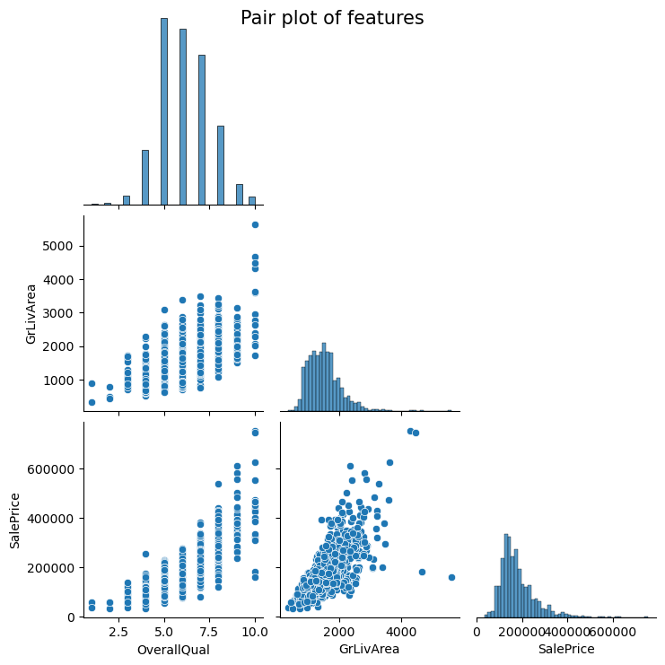

# django-vendors

## Development

**Purpose**: Towards a multi-featured real estate marketplace.

**Outline**:\
<ins> 1. Helping vendors in pricing their real estate via regression model of housing data. </ins>



*Step 1a*. vendor's item data (e.g. collected via an online form)
| Item | OverallQual (0-10) | GrLivArea (sq.ft.) | SaleType |
| --- | --- | --- | --- |
| A | 7 | 1717 | Family |
| B | 5 | 1500 | Normal |
| C | 6 | 2500 | AdjLand |

*Step 1b*. pricing obtained via pre-trained model in pricing directory
| Item | Pricing |
| --- | --- |
| A | $219,382 |
| B | $134,767 |
| C | $221,137 |

<ins> 2. A tutorial of Python-based Django website. </ins>


## Testing and Operations

**Dependency**: Anaconda3 for Windows; and those listed in environment.yml

**Usage**:

*Step 1a*. virtual environment via Anaconda
```
C:\ProgramData\Anaconda3\Scripts\activate
```

*Step 1b*. create via environment.yml
```
conda env create -f environment.yml
```

*Step 1c*. activate virtual environment
```
conda activate vendors
```

*Step 2a*. run server and open in browser
```
python manage.py runserver
# Ctrl+click on local development server link (http://localhost:8000)
# Ctrl+C to quit the server
```

*Step 2b*. remove virtual environment
```
conda env remove --name vendors
```

## Queries

If you have any questions, feel free to add an issue in this repository.
